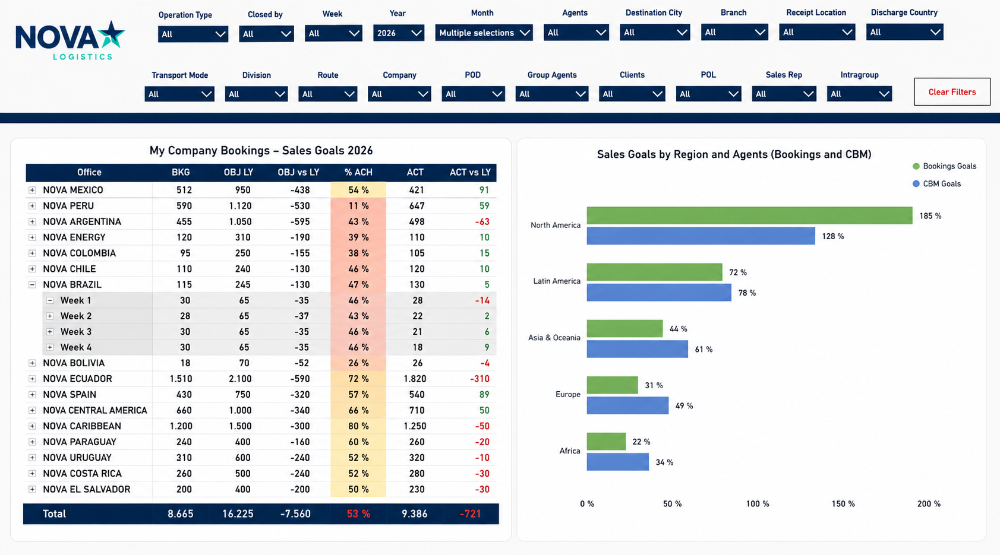
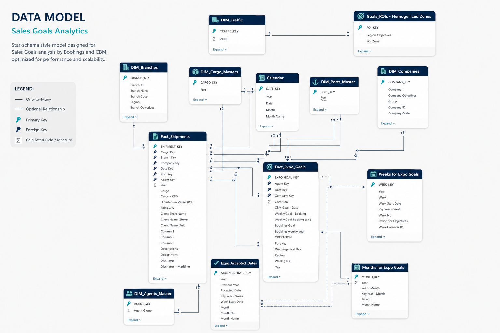

# Logistics Global Performance & Sales Goals Dashboard

## 📊 Visualización Principal

## 📌 Escenario de Negocio
La Dirección Comercial requería monitorear el cumplimiento de objetivos de ventas por Booking (bkg) y volumen (CBM) por región, oficina, puerto de carga, puerto de descarga y agente en tiempo real. Anteriormente no estaba estandarizado y cada oficina regional los media trimestralmente. Este dashboard, centraliza la operación de múltiples oficinas y permite identificar rapidamente el status de cumplimiento de ventas para seguimiento de las areas comerciales de cada oficina. 

## 🛠️ Stack Tecnológico
* **Herramienta de BI:** Power BI Desktop.
* **Modelado:** Esquema en estrella (Star Schema).
* **ETL:** Power Query y Python (Pandas) para normalización. Datos segmentados por RLS
* **Orquestación:** Apache Airflow.
* **Lenguajes:** DAX, SQL (Oracle), Python.

## Desafíos Técnicos Resueltos

* **Manejo de granularidad temporal:** Diseño de un modelo capaz de cruzar transacciones operativas diarias (ventas/bookings) con objetivos comerciales evitando la duplicación de valores en las agregaciones. Estos objetivos fueron definidos tanto a nivel semanal y mensual y por oficina, Region, POD, POL y Agente. 
* **Exposición de datos sin transacciones (Puntos ciegos):** Implementación de lógica DAX avanzada y configuración de visualizaciones para anular el comportamiento nativo que oculta nodos sin ventas. Esto fuerza la visualización de agencias o puertos con presupuesto asignado pero rendimiento operativo nulo.
* **Control de jerarquías dinámicas:** Desarrollo de cálculos que detectan el contexto de filtro activo (Nivel Global, Región, Puerto o Agente) para reasignar y calcular los presupuestos sin corromper la matemática de los subtotales de la matriz.

## Impacto y Resultados

* **Visibilidad operativa inmediata:** Identificación instantánea del rendimiento operativo de cada oficina, eliminando el procesamiento manual de múltiples hojas de cálculo y con ellos los excesivos tiempos de reacción
* **Integridad de datos:** Alineación exacta entre los datos del sistema y los objetivos comerciales mediante la corrección estructural de las bases de origen, garantizando KPIs de cumplimiento precisos.
* **Consolidación de herramientas analíticas:** Arquitectura escalable que centraliza el análisis de múltiples unidades de negocio (Exportación, Importación, Marítimo, Aéreo) en un único modelo semántico interactivo.

---

## 🏗️ Arquitectura de Datos y Modelo
El núcleo del proyecto es un **Esquema en Estrella** que permite un filtrado eficiente y escalabilidad.

### Capa de Ingeniería (ETL & SQL)
El flujo de datos se sostiene sobre una estructura robusta:

* **Extracción (SQL):** Se utilizan consultas optimizadas en Oracle para pre-procesar los datos y reducir la carga en el motor de Power BI. Ver archivo: `assets/DWH_EXPORT_SALES.sql`.
* **Automatización (Python):** El script `assets/DWH_EXPORT_SALES.py` gestiona la validación de integridad de los archivos regionales antes de la ingesta, asegurando que no existan nulos en campos de facturación clave.

---

